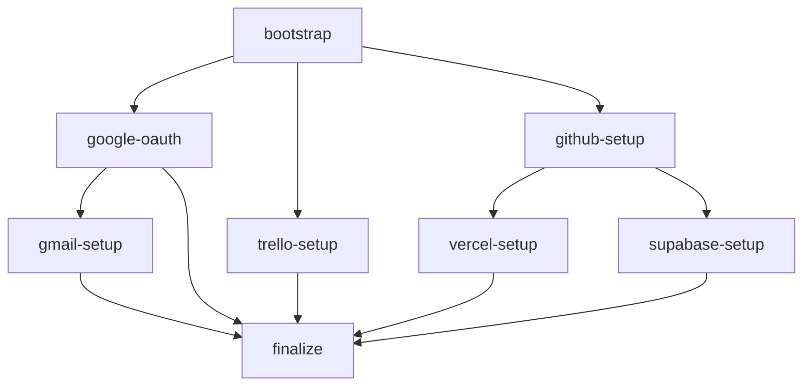

# Especificación de Integración: VCOO Onboarding

**Versión:** 2.3.0  
**Autor:** MAGI — VERSUS Strategy SL  
**Fecha:** 2026-07-07  
**Estado:** Implementación

---

## Índice

1. [Visión General](#1-visión-general)
2. [Arquitectura](#2-arquitectura)
3. [Modelo de Datos](#3-modelo-de-datos)
4. [API: Endpoints de Onboarding](#4-api-endpoints-de-onboarding)
5. [Agente Polling (agent_http.py)](#5-agente-polling-agent_httppy)
6. [Flujo de Reporte Único con ACK](#6-flujo-de-reporte-único-con-ack)
7. [Módulos y Pasos del Onboarding](#7-módulos-y-pasos-del-onboarding)
8. [Instalación Inicial (install.sh)](#8-instalación-inicial-installsh)
9. [Flujo de Error y Recuperación](#9-flujo-de-error-y-recuperación)
10. [Cleanup Post-Onboarding](#10-cleanup-post-onboarding)
11. [Lo que Queda en el Servidor del Cliente](#11-lo-que-queda-en-el-servidor-del-cliente)
12. [Frontend: Wizard de Setup](#12-frontend-wizard-de-setup)
13. [Seguridad](#13-seguridad)
14. [Plan de Implementación](#14-plan-de-implementación)

---

## 1. Visión General

El sistema VCOO Onboarding orquesta la instalación y configuración de un asistente COO Virtual (MAGI) en el servidor de un cliente. El proceso está guiado por una **interfaz web paso a paso** (sin intervención de IA) que el cliente sigue desde su navegador. Un **agente polling ligero** se ejecuta en el servidor del cliente para ejecutar verificaciones y reportar resultados al control plane.

### Principios de diseño

- **Sin IA en el onboarding:** El cliente interactúa con formularios web, botones e instrucciones claras, no con un chatbot.
- **Progreso persistente:** El cliente puede cerrar el navegador y retomar donde lo dejó.
- **Reporte único con ACK:** Cada verificación se reporta una sola vez; el agente reintenta hasta recibir confirmación.
- **Sin bloat post-onboarding:** El agente polling se borra a sí mismo al finalizar. Solo queda Hermes Agent + skills + scripts de integración.
- **MAGI se presenta al final:** Cuando todo está configurado, MAGI aparece en Discord/Telegram del equipo.
- **7 días de margen:** Los tokens de provision duran 7 días para que el cliente configure cuando tenga disponibilidad.

---

## 2. Arquitectura

```
┌───────────────────────────────────────────────────┐
│         FRONTEND (apps/frontend — React + Vite)    │
│                                                    │
│  /dashboard      → Panel del operador              │
│  /setup/:token   → Wizard de instalación           │
│  Poll cada 15s a GET /setup/:token                 │
└─────────────────────┬─────────────────────────────┘
                      │ HTTP (API calls)
                      ▼
┌───────────────────────────────────────────────────┐
│     BACKEND (apps/backend — FastAPI + Vercel)      │
│                                                    │
│  POST   /vcoo                         Crear VCOO   │
│  GET    /vcoo/:id/state               Estado       │
│  POST   /vcoo/:id/provision-token     Generar token│
│  GET    /setup/:token                 Info wizard  │
│  POST   /register                     Registrar ag.│
│  GET    /agent/:id/poll                Poll comandos│
│  POST   /agent/:id/result             Reportar ACK │
│  POST   /agent/:id/tick               Tick unificado│
│  POST   /agent/heartbeat              Heartbeat    │
│  GET    /install.sh                   Installer    │
│  GET    /playbooks/:name/raw          Scripts aux. │
│  GET    /auth/callback                OAuth callback│
│  GET    /setup/:token/auth-url        URL OAuth    │
└──────────┬──────────────────┬─────────────────────┘
           │ SQLAlchemy       │ WebSocket (ws_bridge)
           ▼                  ▼
┌──────────────────┐ ┌──────────────────────┐
│  SUPABASE (PG)   │ │  WS Bridge (mem)     │
│                  │ │  Logs en tiempo real  │
│  vcoos           │ └──────────────────────┘
│  onboarding_state│
│  provision_tokens│
│  agents          │
│  commands        │
│  command_logs    │
│  operators       │
│  clients         │
│  revoked_tokens  │
│  audit_log       │
│  vcoo_dashboard  │
└──────────────────┘
         │ polling cada 15s (GET /agent/:id/poll)
         ▼
┌───────────────────────────────────────────────────┐
│   AGENTE (packages/vcoo-supervisor — tick.py)      │
│   (se ejecuta en servidor del cliente)             │
│                                                    │
│  Plugin tick.py (cada 60s, 5s si hay comandos):   │
│  1. POST /agent/:id/tick → comandos + health      │
│  2. Ejecuta scripts VCOO según COMMAND_MAP        │
│  3. Reporta resultado en la misma respuesta tick  │
│  4. save-creds: guarda tokens OAuth en disco      │
│  5. Si "finalize" → limpia y termina              │
│                                                    │
│  Alternativa: packages/agent/agent.py (standalone) │
│  Bucle simple de poll + execute + report           │
└───────────────────────────────────────────────────┘
```

### Flujo completo de instalación

```
OPERADOR                    CLIENTE                     SERVIDOR CLIENTE
   │                          │                              │
   │  Crea VCOO + módulos     │                              │
   │  Comparte enlace setup   │                              │
   │ ─────────────────────►   │                              │
   │                          │  Abre /setup/:token          │
   │                          │  Ve instrucciones            │
   │                          │  Copia one-liner             │
│  │  Lo pega en su terminal      │
│  │ ─────────────────────────►   │
│  │                              │  curl | bash
│  │                              │  1. Crea venv + instala deps
│  │                              │  2. Descarga scripts VCOO
│  │                              │  3. Descarga y lanza agent
   │                          │                              │
   │                          │                              │  agent_http.py:
   │                          │                              │  → POST /register
   │                          │                              │  → Bucle poll + ejecutar
   │                          │  ◄── Wizard muestra pasos ──►│
   │                          │  [Google OAuth] [Verificar]  │
   │                          │  [Trello]       [Verificar]  │
   │                          │  ...                         │
   │                          │  ✅ Onboarding completado    │
   │                          │                              │  Limpia y auto-borra
   │                          │                              │  Arranca Hermes Gateway
   │                          │  🎉 "MAGI está lista"        │
```

---

## 3. Modelo de Datos

### 3.1 Tablas existentes

Las tablas `vcoos`, `provision_tokens`, `agents`, `commands`, `command_logs`, `operators`, `clients`, `revoked_tokens`, `audit_log` y la vista `vcoo_dashboard` existen en Supabase. Ver `supabase/migrations/20260706000000_full_schema.sql`.

### 3.2 Nueva tabla: `onboarding_state`

```sql
create table if not exists onboarding_state (
    vcoo_id     uuid primary key references vcoos(id) on delete cascade,
    step        text not null default 'bootstrap',
    -- Paso actual: bootstrap | google-oauth | trello-setup | github-setup |
    --              vercel-setup | supabase-setup | knowledge-base | finalize | done

    status      text not null default 'in_progress',
    -- in_progress | blocked | completed

    modules     jsonb not null default '[]',
    -- Módulos contratados: ["core", "office", "mail", "planner", "developer"]

    completed   jsonb not null default '[]',
    -- Pasos completados: ["bootstrap", "google-oauth"]

    errors      jsonb not null default '[]',
    -- Errores: [{"step": "google-oauth", "error": "...", "timestamp": "..."}]

    retry_count jsonb not null default '{}',
    -- Reintentos por paso: {"google-oauth": 2}

    updated_at  timestamptz not null default now()
);

-- Trigger para actualizar updated_at automáticamente
create or replace function update_onboarding_timestamp()
returns trigger as $$
begin
    new.updated_at = now();
    return new;
end;
$$ language plpgsql;

create trigger trg_onboarding_timestamp
    before update on onboarding_state
    for each row
    execute function update_onboarding_timestamp();
```

### 3.3 Extensión a tabla `commands`

Los comandos existentes se extienden con campos para el sistema de pasos:

```sql
alter table commands add column if not exists step text;
alter table commands add column if not exists ttl_seconds integer default 300;
alter table commands add column if not exists sent_at timestamptz;
alter table commands add column if not exists acked boolean default false;
```

### 3.4 Vista para el dashboard del operador

```sql
create or replace view vcoo_dashboard as
select
    v.id as vcoo_id,
    v.name,
    v.created_at,
    os.step,
    os.status as onboarding_status,
    os.modules,
    os.completed,
    os.errors,
    a.id as agent_id,
    a.status as agent_status,
    a.last_seen as agent_last_seen,
    (select count(*) from commands c where c.agent_id = a.id and c.status = 'pending') as pending_commands
from vcoos v
left join onboarding_state os on os.vcoo_id = v.id
left join lateral (
    select * from agents where vcoo_id = v.id order by last_seen desc limit 1
) a on true
order by v.created_at desc;
```

---

## 4. API: Endpoints de Onboarding

### 4.1 POST /vcoo — Crear VCOO (extendido)

```python
# Request
{
    "name": "Cliente Demo",
    "modules": ["core", "office", "mail"]  # nuevos
}

# Response 201
{
    "id": "uuid",
    "name": "Cliente Demo",
    "modules": ["core", "office", "mail"],
    "onboarding_url": "https://frontend-....vercel.app/setup/<provision_token>"
}
```

**Comportamiento:**
- Crea fila en `vcoos`
- Crea fila en `onboarding_state` con `modules` y `step=bootstrap`
- Genera `provision_token` con JWT (validez **7 días**, uso único)
- Devuelve URL de setup para compartir con el cliente

### 4.2 GET /setup/:token — Info para el wizard (NUEVO)

```python
# Response 200
{
    "vcoo_id": "uuid",
    "name": "Cliente Demo",
    "modules": ["core", "office", "mail"],
    "step": "google-oauth",
    "status": "in_progress",
    "completed": ["bootstrap"],
    "errors": [],
    "progress": {
        "total": 4,
        "done": 1
    },
    "install_command": "curl -sSL https://.../install.sh | PROVISION_TOKEN=... bash -"
}
```

**Comportamiento:**
- Valida el `provision_token` (sin consumirlo — solo lectura)
- Busca el `vcoo_id` asociado al token
- Devuelve `onboarding_state` + `progress` calculado + `install_command`
- Si el token ya fue usado para registro → sigue devolviendo el estado (el wizard se puede recargar)

### 4.3 GET /agent/:id/poll — Poll de comandos (existente, extendido)

```python
# Response
{
    "commands": [
        {
            "cmd_id": "uuid",
            "command": "verify-google",     # ver nombres en §7
            "step": "google-oauth",
            "params": {}                    # parámetros adicionales si aplica
        }
    ]
}
```

Los comandos son **efímeros**: una vez enviados en un poll, se marcan como `sent` con `sent_at=now()`. Si el agente no reporta resultado en `ttl_seconds`, el comando puede reintentarse.

### 4.4 POST /agent/:id/result — Reportar resultado (NUEVO)

```python
# Request
{
    "cmd_id": "uuid",           # ID del comando que se ejecutó
    "step": "verify-google",    # Paso del onboarding
    "status": "ok",             # ok | error
    "output": "20 archivos encontrados en Google Drive",  # texto legible
    "details": {}               # JSON opcional con datos estructurados
}

# Response 201 — ACK
{
    "ack": true,
    "cmd_id": "uuid",
    "next_step": "trello-setup"  # siguiente paso sugerido
}

# Response 409 — Comando ya reportado (idempotencia)
{
    "ack": true,
    "status": "already_reported"
}
```

**Comportamiento:**
1. Busca el comando por `cmd_id`
2. Si ya fue reportado (`acked=true`) → `409` (idempotente, el agente deja de reintentar)
3. Si no existe → `404` (el agente descarta el resultado)
4. Si existe y está pendiente:
   - Marca comando como `done` + `acked=true`
   - Guarda `output` como `result`
   - Si `status=ok`: añade paso a `onboarding_state.completed[]`
   - Si `status=error`: añade a `onboarding_state.errors[]`, incrementa `retry_count`
   - Si todos los pasos están completos → avanza a `step=finalize`
   - Devuelve `201 + {"ack": true, "next_step": "..."}`

### 4.5 GET /vcoo/:id/state — Estado del onboarding

```python
# Response 200
{
    "vcoo_id": "uuid",
    "name": "Cliente Demo",
    "modules": ["core", "office", "mail"],
    "step": "google-oauth",           # paso actual
    "status": "in_progress",          # in_progress | blocked | completed
    "completed": ["bootstrap"],       # pasos ya verificados
    "errors": [],
    "progress": {
        "total": 5,                   # pasos totales según módulos
        "done": 1
    },
    "agent": {
        "id": "uuid",
        "status": "online",
        "last_seen": "2026-06-22T12:00:00Z"
    }
}
```

### 4.6 POST /agent/heartbeat — Heartbeat del agente (NUEVO)

```python
# Request
{
    "agent_id": "uuid",
    "vcoo_id": "uuid"
}

# Response 200
{"ack": true}
```

El agente polling envía heartbeat cada 60s. Si el control plane no recibe heartbeat durante **5 minutos**, marca el agente como `offline`.

---

## 5. Agente Polling

Hay dos implementaciones del agente:

- **Producción:** `packages/vcoo-supervisor/plugins/tick.py` — plugin del supervisor que unifica health + comandos en un solo tick
- **Standalone/POC:** `packages/agent/agent.py` — versión simple con bucle poll + execute + report

### 5.1 Supervisor tick (producción)

El plugin `tick.py` (en `packages/vcoo-supervisor/`) ejecuta un tick cada 60s (o 5s si hay comandos pendientes):

1. Envía `POST /agent/:id/tick` con health + ACK de comando anterior
2. Recibe comandos pendientes en la respuesta
3. Ejecuta cada comando según COMMAND_MAP
4. Reporta resultado en el siguiente tick

### 5.2 COMMAND_MAP — Ejecución de comandos

Definido en `tick.py`. El agente **NO ejecuta comandos arbitrarios**:

```python
COMMAND_MAP = {
    "verify-bootstrap": ["python3", "~/.hermes/scripts/vcoo/vcoo-bootstrap.py"],
    "verify-google":    ["python3", "~/.hermes/scripts/vcoo/vcoo-google.py", "drive", "list"],
    "verify-trello":    ["python3", "~/.hermes/scripts/vcoo/vcoo-trello.py", "boards"],
    "verify-email":     ["python3", "~/.hermes/scripts/vcoo/vcoo-email.py", "list", "3"],
    "verify-github":    ["gh", "repo", "list", "--limit", "3"],
    "verify-vercel":    ["vercel", "projects", "ls", "--limit", "3"],
    "verify-supabase":  ["supabase", "status"],
    "save-creds":       None,  # manejado por tick.py _handle_save_creds()
    "finalize":         None,  # manejado internamente
}
```

Comandos especiales con handlers dedicados:
- `save-creds` — escribe tokens OAuth en `~/.hermes/google_token.json` y configura `google.client_id` vía `hermes config set`
- `set-provider` — configura el proveedor de IA vía `hermes config set model.provider/default`

**Si un comando no está en COMMAND_MAP, el agente lo ignora** (no ejecuta nada fuera de la lista).

### 5.3 Agente standalone (agent.py)

Para entornos sin el supervisor, `packages/agent/agent.py` implementa un bucle más simple:
1. Registra el agente via `POST /register`
2. Almacena `agent_token` cifrado con Fernet + `master.key`
3. Poll `GET /agent/:id/poll` cada 15s (+ jitter 0-2s)
4. Ejecuta comandos (simulados en POC)
5. Reporta vía `POST /vcoo/:id/commands/:cmd_id/result`

### 5.3 Mecanismo de reporte con ACK

```python
async def report_with_retry(agent_id, agent_token, cmd, result, max_retries=3):
    payload = {
        "cmd_id": cmd["cmd_id"],
        "step": cmd.get("step", ""),
        "status": "ok" if result["exit_code"] == 0 else "error",
        "output": result["output"]
    }
    
    for attempt, delay in enumerate([5, 15, 30]):  # backoff: 5s, 15s, 30s
        try:
            resp = await client.post(
                f"{CONTROL_PLANE}/agent/{agent_id}/result",
                json=payload,
                headers={"Authorization": f"Bearer {agent_token}"},
                timeout=10
            )
            if resp.status_code in (201, 409):
                log(f"✅ Comando {cmd['cmd_id']} reportado (ACK recibido)")
                return True
        except Exception as e:
            log(f"⚠️  Intento {attempt+1}/{max_retries} falló: {e}")
        
        if attempt < max_retries - 1:
            await asyncio.sleep(delay)
    
    log(f"❌ No se pudo reportar comando {cmd['cmd_id']} después de {max_retries} intentos")
    return False
```

---

## 6. Flujo de Reporte Único con ACK

```
agent_http.py                    Control Plane
    │                                  │
    │  POST /agent/:id/result          │
    │  {"cmd_id":"v-001",              │
    │   "status":"ok",                 │
    │   "output":"20 archivos"}        │
    │ ─────────────────────────────►   │
    │                                  │  Valida cmd_id
    │                                  │  Marca como done + acked
    │                                  │  Actualiza onboarding_state
    │                  201             │
    │  ◄───────────────────────────── │
    │         {"ack": true}            │
    │                                  │
    │  ┌─ ¿Timeout? ─→ reintento x3 ──│
    │  └─ ¿409? ───→ ya reportado, OK │
    │  └─ ¿404? ───→ comando inválido │
```

### Casuística

| Situación | Código HTTP | Acción del agente |
|---|---|---|
| Reporte exitoso | 201 | ✅ Deja de reintentar |
| Ya reportado | 409 | ✅ Deja de reintentar (idempotente) |
| Comando no encontrado | 404 | ❌ Descarta, no reintenta |
| Timeout de red | — | ⏳ Reintenta (5s, 15s, 30s) |
| Error 5xx | 500/502/503 | ⏳ Reintenta |

---

## 7. Módulos y Pasos del Onboarding

Cada módulo contratado añade pasos específicos al flujo:

| Paso | Comando de verificación | Módulo requerido | Script VCOO | Depende de |
|---|---|---|---|---|
| `bootstrap` | `verify-bootstrap` | **CORE** *(siempre)* | `vcoo-bootstrap.py` | — |
| `google-oauth` | `verify-google` | OFFICE | `vcoo-google.py drive list` | `bootstrap` |
| `gmail-setup` | `verify-email` | MAIL | `vcoo-email.py list 3` | `google-oauth` |
| `trello-setup` | `verify-trello` | PLANNER | `vcoo-trello.py boards` | `bootstrap` |
| `github-setup` | `verify-github` | DEVELOPER | `gh repo list --limit 3` | `bootstrap` |
| `vercel-setup` | `verify-vercel` | DEVELOPER | `vercel projects ls --limit 3` | `github-setup` |
| `supabase-setup` | `verify-supabase` | DEVELOPER | `supabase status` | `github-setup` |
| `finalize` | `finalize` | **Siempre** | cleanup + autoborrado | *(todos los contratados)* |

### Dependencias entre pasos



> Los pasos que no corresponden a módulos contratados se saltan automáticamente.

### Enforce de dependencias en el backend

```python
STEP_DEPENDENCIES = {
    "bootstrap":     [],
    "google-oauth":  ["bootstrap"],
    "gmail-setup":   ["bootstrap", "google-oauth"],
    "trello-setup":  ["bootstrap"],
    "github-setup":  ["bootstrap"],
    "vercel-setup":  ["bootstrap", "github-setup"],
    "supabase-setup":["bootstrap", "github-setup"],
    "finalize":      [],  # especial: requiere todos los contratados
}

def can_advance_to(step: str, completed: list[str], modules: list[str]) -> bool:
    """Un paso solo se puede iniciar si todos sus requisitos están completados."""
    deps = STEP_DEPENDENCIES.get(step, [])
    # Filtrar deps que no aplican (módulo no contratado)
    required = [d for d in deps if d in get_steps_for_modules(modules)]
    return all(d in completed for d in required)
```

### Cálculo de progreso

```python
def get_steps_for_modules(modules: list[str]) -> list[str]:
    """Devuelve los pasos necesarios según módulos contratados"""
    steps = ["bootstrap"]  # siempre
    if "office" in modules:   steps.append("google-oauth")
    if "mail" in modules:     steps.append("gmail-setup")
    if "planner" in modules:  steps.append("trello-setup")
    if "developer" in modules:
        steps.extend(["github-setup", "vercel-setup", "supabase-setup"])
    steps.append("finalize")
    return steps

def get_total_steps(modules: list[str]) -> int:
    return len(get_steps_for_modules(modules))
```

---

## 8. Instalación Inicial (install.sh)

### 8.1 Responsabilidades del install.sh

Instalador real en `packages/agent/install.sh` (v2.4). Cuando el cliente ejecuta el one-liner:

1. **Verificar Python 3.10+** — instalarlo si falta (gestor de paquetes del sistema)
2. **Instalar uv** (opcional, 10x más rápido)
3. **Crear venv** con 3-tier fallback (uv → venv → venv+sin-pip → pip --user)
4. **Instalar dependencias** `requests` + `rich` en el venv
5. **Descargar scripts VCOO** desde `/playbooks/:name/raw` a `~/.hermes/scripts/vcoo/`
6. **Descargar agent* desde `CONTROL_PLANE/agent_http.py` a `~/.vcoo-agent/agent_http.py`
7. **Ejecutar agente** en foreground

```bash
#!/usr/bin/env bash
# packages/agent/install.sh — VCOO Agent Installer v2.4
# One-liner: curl -sSL <url>/install.sh | PROVISION_TOKEN=*** bash -
set -euo pipefail

CONTROL_PLANE="${CONTROL_PLANE:-https://vcoo-onboarding.vercel.app}"
AGENT_URL="${AGENT_URL:-${CONTROL_PLANE}/agent_http.py}"
AGENT_HOME="${AGENT_HOME:-$HOME/.vcoo-agent}"
VENV_DIR="$AGENT_HOME/venv"
HERMES_DIR="${HERMES_DIR:-$HOME/.hermes}"
VCOO_DIR="$HERMES_DIR/scripts/vcoo"

# ── 1. Python 3 ──
if ! command -v python3 >/dev/null 2>&1; then
    apt-get install -y -qq python3
fi

# ── 2. Venv con 3-tier fallback ──
# Tier 1: uv venv
# Tier 2: python3 -m venv
# Tier 3: --without-pip + get-pip.py
ensure_venv() { ... }

# ── 3. Instalar deps ──
"$VENV_DIR/bin/pip" install -q requests rich

# ── 4. Descargar scripts VCOO ──
for script in vcoo-bootstrap.py vcoo-google.py vcoo-trello.py vcoo-email.py; do
    curl -fsSf -o "$VCOO_DIR/$script" "$CONTROL_PLANE/playbooks/$script/raw"
    chmod 700 "$VCOO_DIR/$script"
done

# ── 5. Descargar y ejecutar agente ──
curl -fsSf -o "$AGENT_HOME/agent_http.py" "$AGENT_URL"
exec "$VENV_DIR/bin/python" "$AGENT_HOME/agent_http.py" "$CONTROL_PLANE" "$PROVISION_TOKEN"
```

### 8.2 Script `vcoo-bootstrap.py` — Verificación inicial

```python
#!/usr/bin/env python3
"""vcoo-bootstrap: verifica que el entorno base está correcto."""
import sys, os, subprocess, json

results = {"ok": [], "fail": []}

# 1. Python version
py_ver = f"{sys.version_info.major}.{sys.version_info.minor}"
results["ok"].append(f"Python {py_ver}")

# 2. Hermes binary
try:
    r = subprocess.run(["hermes", "--version"], capture_output=True, text=True, timeout=10)
    results["ok"].append(f"Hermes: {r.stdout.strip()}")
except:
    results["fail"].append("Hermes Agent no encontrado")

# 3. Scripts VCOO presentes
vcoo_dir = os.path.expanduser("~/.hermes/scripts/vcoo")
for script in ["vcoo-google.py", "vcoo-trello.py", "vcoo-email.py"]:
    path = os.path.join(vcoo_dir, script)
    if os.path.isfile(path):
        results["ok"].append(f"Script {script} presente")
    else:
        results["fail"].append(f"Script {script} no encontrado")

# 4. requests module
try:
    import requests
    results["ok"].append("Python requests module")
except ImportError:
    results["fail"].append("Python requests no instalado")

print(json.dumps(results, indent=2))
sys.exit(0 if not results["fail"] else 1)
```

---

## 9. Flujo de Error y Recuperación

### 9.1 Ciclo de vida de un error

```
Paso activo → agente ejecuta verify → falla → backend registra error
                                               │
                    ┌──────────────────────────┐
                    ▼                          ▼
            retry_count < 3              retry_count >= 3
                    │                          │
                    ▼                          ▼
        Reencola comando              Marca paso como BLOCKED
        (TTL 60s)                     Notifica al operador
        Cliente ve "⏳ Reintentando"   Cliente ve "❌ Bloqueado"
        Sin intervención manual       Requiere intervención del operador
```

### 9.2 Comportamiento por capa

| Capa | ¿Qué hace? |
|---|---|
| **Agente** | Ejecuta el script VCOO. Si falla, reporta `status=error` con el mensaje. Reintenta el ACK 3 veces. |
| **Backend** | Al recibir `status=error`: registra en `onboarding_state.errors[]`, incrementa `retry_count[step]`. Si `retry_count < 3`: reencola el mismo comando con TTL 60s. Si `retry_count >= 3`: marca `step` como `blocked`. |
| **Frontend wizard** | Muestra el error al cliente con el mensaje del agente. Si `retry_count < 3`: animación "⏳ Reintentando automáticamente...". Si `blocked`: muestra "❌ Este paso necesita atención. Contacta con el equipo de VERSUS." + botón "Notificar soporte". |
| **Dashboard operador** | El VCOO aparece con badge "⚠️ Bloqueado". El operador puede ver el error, reintentar manualmente, o marcar el paso como `skip`. |

### 9.3 Tipos de error y acciones

| Error típico | Causa probable | Acción automática | Acción manual |
|---|---|---|---|
| `requests module not found` | `pip install` falló en bootstrap | Reintentar ×3, luego bloquear | Operador reinstala `requests` |
| `Google OAuth token expired` | El cliente no autorizó a tiempo | Reintentar ×3 | Cliente reautoriza en Google |
| `gh: command not found` | GitHub CLI no instalado | Reintentar ×1, bloquear | Operador instala `gh` |
| `vercel: not logged in` | Cliente no hizo `vercel login` | Mostrar instrucción en wizard | Cliente ejecuta `vercel login` |
| `Connection refused` | Servicio externo caído | Reintentar ×3 con backoff | Esperar a que el servicio vuelva |
| `Timeout` | Red lenta o firewall | Reintentar ×3 | Cliente verifica conectividad |

### 9.4 Reintento manual desde el dashboard

El operador puede, desde el dashboard, hacer clic en "Reintentar paso" para un VCOO bloqueado. Esto:
1. Resetea `retry_count[step] = 0`
2. Cambia `status = in_progress`
3. Encola un nuevo comando de verificación
4. El agente lo recoge en el siguiente poll

### 9.5 Skip de paso (solo operador)

Si un paso es imposible de completar (ej: el cliente no usa Trello pero lo contrató), el operador puede marcarlo como `skip`:
1. El paso se añade a `completed[]`
2. Se registra en `errors[]` con `"skipped_by_operator": true`
3. El wizard muestra el paso como "⏭️ Omitido"

---

## 10. Cleanup Post-Onboarding

Cuando el agente recibe el comando `finalize`:

```python
async def finalize(vcoo_id):
    """Limpieza final del onboarding"""
    
    # 1. Arrancar Hermes gateway
    try:
        subprocess.run(["systemctl", "--user", "start", "hermes-gateway"],
                      capture_output=True, timeout=30)
    except:
        subprocess.Popen(["hermes", "gateway", "run"],
                        stdout=subprocess.DEVNULL,
                        stderr=subprocess.DEVNULL)
    
    # 2. Publicar mensaje de bienvenida (via control plane)
    await client.post(f"{CONTROL_PLANE}/agent/{agent_id}/finalize",
                      json={"vcoo_id": vcoo_id})
    
    # 3. Limpiar archivos temporales
    temp_dirs = ["/tmp/vcoo-installer", "/tmp/vcoo-*"]
    for pattern in temp_dirs:
        for p in glob.glob(pattern):
            shutil.rmtree(p, ignore_errors=True)
    
    # 4. Borrar credenciales de provision
    storage_dir = os.path.expanduser("~/.vcoo-agent/")
    for f in ["agent.json", "agent.token"]:
        path = os.path.join(storage_dir, f)
        if os.path.exists(path):
            os.remove(path)
    try:
        os.rmdir(storage_dir)
    except OSError:
        pass
    
    # 5. Autoborrado
    script_path = os.path.abspath(__file__)
    os.remove(script_path)
    
    # 6. Salir
    log("🧹 Onboarding completado. agent_http.py eliminado.")
    sys.exit(0)
```

---

## 11. Lo que Queda en el Servidor del Cliente

Después del cleanup, persiste únicamente:

```
~/.hermes/
├── config.yaml                    ← Configuración Hermes
├── .env                           ← API keys (solo las contratadas)
├── SOUL.md                        ← Personalidad MAGI
├── google_token.json              ← Token OAuth Google (auto-refresh)
│
├── skills/versus-multiagent-orchestration/
│   ├── vcoo-core/SKILL.md         ← Skill CORE
│   ├── vcoo-google-workspace/     ← Skill OFFICE (si contratado)
│   ├── vcoo-email/                ← Skill MAIL (si contratado)
│   ├── vcoo-trello/               ← Skill PLANNER (si contratado)
│   └── vcoo-pdf/                  ← Skill PDF (si contratado)
│
├── scripts/vcoo/
│   ├── vcoo-bootstrap.py          ← Script verificación inicial
│   ├── vcoo-trello.py             ← Script Trello
│   ├── vcoo-google.py             ← Script Google
│   ├── vcoo-email.py              ← Script Gmail
│   └── vcoo-pdf.py                ← Script PDF
│
└── cron/                          ← Watchdogs configurados
```

**Eliminado durante el cleanup:**
- `agent_http.py` ✗ — Script del agente polling
- `install.sh` ✗ — Instalador
- `~/.vcoo-agent/` ✗ — Tokens de provision
- `/tmp/vcoo-*` ✗ — Archivos temporales

---

## 12. Frontend: Wizard de Setup

### 12.1 Página /setup/:token

```
┌──────────────────────────────────────────────┐
│  ✅ Token verificado                          │
│                                               │
│  Tu VCOO:              [nombre del cliente]   │
│  Estado:               En configuración       │
│                                               │
│  ─── Progreso: 2/5 ──▓▓▓░░░░░░░░░░           │
│                                               │
│  ┌──────────────────────────────────────┐     │
│  │  Paso actual: Google Workspace       │     │
│  │                                      │     │
│  │  1. Abre este enlace en tu navegador │     │
│  │     [🔗 Autorizar Google]            │     │
│  │                                      │     │
│  │  2. Después de autorizar, vuelve aquí│     │
│  │                                      │     │
│  │  3. Haz clic en "Verificar"          │     │
│  │     [🔍 Verificar conexión]          │     │
│  │                                      │     │
│  │  ⏳ MAGI está comprobando...         │     │
│  │                                      │     │
│  │  ✅ Google Drive: 20 archivos OK     │     │
│  │                                      │     │
│  │  ❌ Error: Token expirado            │     │
│  │     [🔄 Reintentar]                  │     │
│  └──────────────────────────────────────┘     │
│                                               │
│  ─── Pasos completados: ───                   │
│  ✅ 1. Instalación base                       │
│  ⏳ 2. Google Workspace (actual)              │
│  ☐  3. Trello                                 │
│  ☐  4. Finalizar                              │
└──────────────────────────────────────────────┘
```

### 12.2 Estados de cada paso

| Estado | Visual | Descripción |
|---|---|---|
| `pending` | ☐ Círculo vacío | Pendiente, bloqueado por paso anterior |
| `active` | ⏳ Spinner + instrucciones | Paso actual, cliente puede interactuar |
| `verifying` | 🔍 Animación "MAGI está comprobando..." | Comando encolado, esperando resultado del agente |
| `done` | ✅ Verde | Verificado correctamente |
| `error` | ❌ Rojo + mensaje + botón reintentar | Error, reintento automático o manual |
| `blocked` | 🚫 Rojo intenso + "Contacta con soporte" | 3 reintentos fallidos, requiere operador |
| `skipped` | ⏭️ Gris | Omitido por el operador |

### 12.3 Polling del frontend

El frontend hace `GET /setup/:token` cada **15 segundos** (`setInterval(fetchOnboarding, 15000)` en `SetupWizard.tsx`) mientras está en la página de setup para actualizar el progreso automáticamente cuando el agente reporta resultados.

---

## 13. Seguridad

### Tokens

### Tokens y autenticación

| Token | Quién lo crea | Validez | Propósito |
|---|---|---|---|
| `provision_token` (JWT) | Backend | **7 días**, 1 uso | Identificar al cliente durante el onboarding |
| `agent_token` (JWT) | Backend | **30 días** | Autenticar al agente en el polling |
| `operator_token` (JWT) | Backend | **24 horas** | Sesión de operador en el dashboard |
| `client_token` (JWT) | Backend | **30 días** | Sesión de cliente en el wizard |
| `MASTER_KEY` | Operador | Permanente | Firmar JWTs + cifrado de API keys |

Implementado en `apps/backend/auth.py` con tres token types: `operator`, `client`, `agent`. Cada token incluye `jti` (JWT ID) para revocación individual vía tabla `revoked_tokens`. Soporta refresh con rotation.

### Comunicaciones

- Todas las llamadas agente → control plane usan **HTTPS** (TLS)
- El `agent_token` viaja en header `Authorization: Bearer ***`
- El control plane valida el token JWT en cada petición
- El agente nunca expone puertos al exterior (solo conexiones salientes)
- WebSocket bridge local (`ws_bridge.py`) para streaming de logs en tiempo real

### Seguridad adicional

| Mecanismo | Dónde |
|---|---|
| JWT con JTI + revocación | `auth.py` + `revoked_tokens` |
| bcrypt (12 rounds) para passwords | `auth.py` |
| Rate limiting (5 intentos/5 min) por IP | `ratelimit.py` |
| Cifrado PBKDF2+XOR+HMAC para API keys | `crypto.py` |
| Fernet para agent token en disco | `packages/agent/agent.py` |
| RLS en todas las tablas de Supabase | Migración SQL |

### Principio de mínimo privilegio

- El `install.sh` se ejecuta sin `sudo` (usuario normal)
- El agente polling **solo ejecuta scripts del COMMAND_MAP** (no comandos arbitrarios)
- Una vez finalizado el onboarding, el agente se borra

---

## 14. Plan de Implementación (histórico)

Items del plan original (SPEC v2.0). Todos implementados:

| # | Componente | Tarea | Estado |
|---|---|---|---|
| 1 | **Backend** | Crear tabla `onboarding_state` + extender `commands` | ✅ Implementado |
| 2 | **Backend** | `POST /agent/:id/result` con ACK + lógica de pasos | ✅ Implementado |
| 3 | **Backend** | `GET /setup/:token` para el wizard | ✅ Implementado |
| 4 | **Backend** | Extender `POST /vcoo` para aceptar `modules` | ✅ Implementado |
| 5 | **Backend** | `GET /vcoo/:id/state` extendido con progreso | ✅ Implementado |
| 6 | **Backend** | `POST /agent/heartbeat` | ✅ Implementado |
| 7 | **Backend** | Reintentos (×3 → blocked) y skip de paso | ✅ Implementado |
| 8 | **Agente** | COMMAND_MAP fijo + scripts VCOO | ✅ Implementado |
| 9 | **Agente** | Reporte con ACK (reintentos + backoff) | ✅ Implementado |
| 10 | **Agente** | Heartbeat periódico (cada 60s) | ✅ Implementado |
| 11 | **Agente** | Comando `finalize` con cleanup + autoborrado | ✅ Implementado |
| 12 | **Playbooks** | Scripts de verificación VCOO | ✅ Implementado |
| 13 | **install.sh** | Instalador v2.4 con venv + uv | ✅ Implementado |
| 14 | **Frontend** | Wizard paso a paso en `/setup/:token` | ✅ Implementado |
| 15 | **Frontend** | Dashboard con módulos, progreso y errores | ✅ Implementado |
| 16 | **Integración** | Tests e2e | 🟡 Tests parciales (pytest auth, Playwright ad-hoc) |

### Mejoras pendientes (ver architecture-review.md)

| # | Mejora | Prioridad |
|---|---|---|
| P1 | Cifrado de credenciales en disco (`~/.hermes/`) | Alta |
| P2 | Timeout + auto-skip para pasos opcionales | Media |
| P3 | Webhooks en vez de polling agente | Media |
| P4 | Supabase Realtime para frontend | Media |
| P5 | Verificación SHA-256 de install.sh | Baja |
| P6 | Rate limiting en `/register` y `/poll` | Baja |
| P7 | Multi-VCOO agent | Baja |
| P8 | Custom domain | Baja |
| P9 | Tests E2E automatizados (Playwright) | Baja |

---

*Documento de especificación v2.0 generado por MAGI para VERSUS Strategy SL.*
